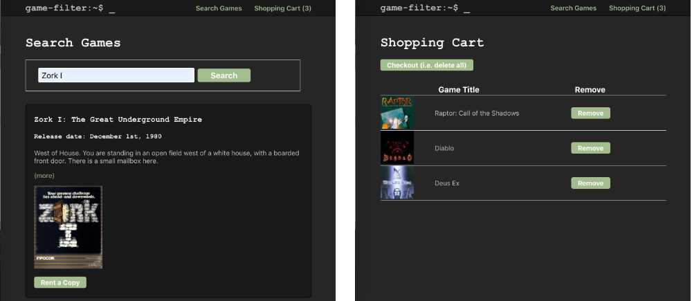

# Game Filter
Prototype of a game rental web store using the Giant Bomb API. You can grab an API key [here](https://www.giantbomb.com/api/). Search for games by title. Add and remove games from your shopping cart.



## Technologies Used
- React
- Redux & Sagas
- Moment.js
- Node
- Express

## Requirements
- Git
- NPM (Node Package Manager)
- Nodemon

## Setup and Run
```bash
# 1. Install project dependencies
npm install

# 2. Write your API key into a file named .env
touch .env 
echo 'API_KEY=<your-giant-bomb-api-key>' >> .env

# 3. Start the client (Runs on localhost:3000)
npm run client

# 4. Start the server (Runs on localhost:5000)
npm run server
```

**Client:** [localhost:3000](http://localhost:3000)

**Server:** [localhost:5000](http://localhost:5000)

## Features

### Completed Features
- [x] Search for games using the Giant Bomb API
- [x] Displays a list of games with an image, a short description, release date, etc.
- [x] Select games from list to add a copy to shopping cart for rental
- [x] Remove items from shopping list or 'checkout' removing all items
- [x] Redux store keeps the two pages synchonized
- [x] Proxy server and environment variables keep the API key hidden from client-side users
- [x] Search strings use URL encoding to handle special characters

### Future Features
- [ ] Unit testing
- [ ] Controls to configure results per page and to scroll forward/backward thru pages
- [ ] Filtering options to refine searches based on gaming platforms or user reviews
- [ ] Using a redux persistence library to allow the user to return to search results after following a 'more' link
- [ ] User authentication
- [ ] Database to save users shopping carts between sessions
- [ ] Limiting API requests from Giant Bomb to only the essential fields. This might produce faster queries.
- [ ] Interface with a second 3rd-party API to get game rental prices or to allow renting games
- [ ] Improving the organization of the project's CSS possibly using styled-components or a CSS preprocessor

## References
- [https://www.giantbomb.com/api/documentation/](https://www.giantbomb.com/api/documentation/)

## Author
Mike Stockman